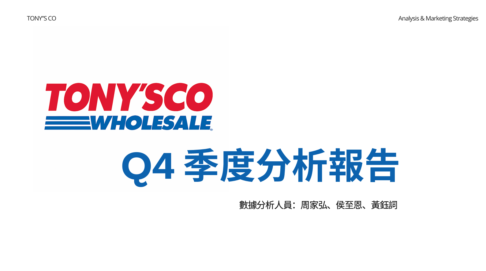

# Retail Data Analytics & Marketing Strategy Proposal

## 🎥 Project Presentation
Click the image below to watch the full presentation:

  

---

## Project Overview

This project analyzes retail transaction data to identify customer behavior patterns and propose data-driven marketing strategies.

The analysis focuses on:

- Customer segmentation
- Sales performance trends
- Product category insights
- Marketing strategy recommendations
